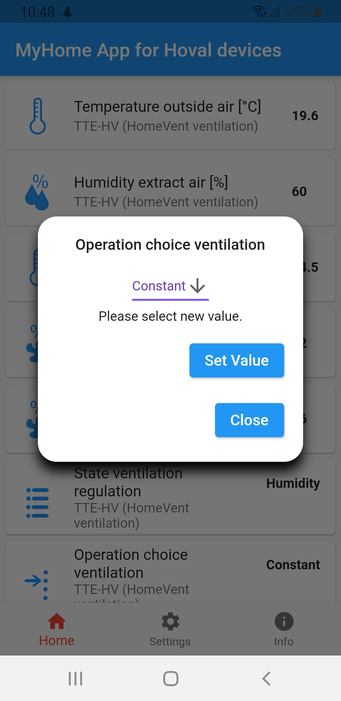

**NEW**: Android app for communication with CAN-Gateway.

The app is written using Flutter framework. It means iOS Version is also possible. However, I do not have MacBook and iPhone, therefore I cannot compile and test iOS version.

