# CAN-Gateway

Detaillierte Bedienungsanleitung hier: [Bedienungsanleitung](Bedienungsanleitung.pdf)

Detailed operating manual in English: [Operating manual](Operating_manual.pdf)

Highlights und erste Schritte: [Highlights_ErsteSchritte](CANGateway_QuickStart.pdf)

Fragen bitte an: cangateway@gmx.de

Aktuell verkaufe ich mein zweites Board, vollständig aufgebaut und mit Vollversion der Software hier: [CAN-Gateway auf Kleinanzeigen](https://www.ebay-kleinanzeigen.de/s-anzeige/can-gateway-hoval-toptronic-r-tte-geraete-in-smarthome-connect/1697283510-168-16390)

Oder auch ein Bausatz zum selber löten: [Bausatz auf Kleinanzeigen](https://www.ebay-kleinanzeigen.de/s-anzeige/can-gateway-hoval-toptronic-e-in-smarthome-connect-bausatz/1697285937-168-16390)

Bisher getestet mit: TTE-HV (HomeVent), TTE-WEZ (Wärmeerzeuger), TTE-HKW (Heizkreis/Warmwasser), TTE-PS (Puffermodul), TTE-SOL (Solar), TTE-BM (Raumbedienmodul), TTE-GW (Gateway), TTE-FW.

Hier ist die Software nur als eine sogenannte "Demo-Version" in kompilierter Form veröffentlicht. Diese hat im Vergleich zur vollen Version einige Einschränkungen (für Details siehe Bedienungsanleitung, Kapitel "Einschränkungen der Demo-Version").

Kurze Beschreibung:

- Diese Software erlaubt es testweise die Geräte der Serie „TopTronic® E“ (TopTronic® E ist die geschützte und eingetragene Marke der Firma Hoval AG) der Firma Hoval Aktiengesellschaft an das Hausautomatisierungssystem anzubinden. Diese Geräte werden im Folgenden einfach „Geräte“ genannt. 
- Die Geräte der Serie „TopTronic® E“ der Firma Hoval Aktiengesellschaft besitzen einen CAN-Bus Anschluss. Dieser wird für die Verbindung der Geräte untereinander verwendet. CAN-Gateway kann an dieses CAN-Bus angeschlossen werden und kann die auf dem Bus übertragenen Daten entschlüsseln und selbst die Daten auf dem Bus generieren, so dass damit Auslesen der Informationen aus den Geräten sowie die Steuerung der Geräte für Testzwecke möglich ist.
- Diese Software selber muss dafür auf einem ESP32 DevKit Board installiert werden. Die genaue Beschreibung der benötigten Hardwarekomponenten und der Aufbau ist in der Bedienungsanleitung zu finden. Der so aufgebaute ESP32 DevKit Board mit installierter Software wird im Folgenden als „CAN-Gateway“ bezeichnet.
- ESP32 DevKit Board besitzt einen WLAN Interface, so dass das Hausautomatisierungssystem kann über WLAN mit dem CAN-Gateway verbunden werden. Als Datenübertragungsprotokolle zwischen CAN-Gateway und dem Hausautomatisierungssystem können wahlweise MQTT Protokoll, Modbus TCP Protokoll oder REST-API verwendet werden, wobei MQTT Protokoll empfohlen wird und Modbus TCP Protokoll nur mit einigen Einschränkungen funktioniert.
- Über WLAN Interface kann CAN-Gateway mithilfe eines Internet Browsers konfiguriert werden.
- NEU: Als Datenlogger mit Speicherung der Daten auf einer SD-Karte einsetzbar (In Verbund mit CAN-Gateway Hardware V5 und höher)

## Einige Bilder/Screenshots:
Aufbau der Hardware:
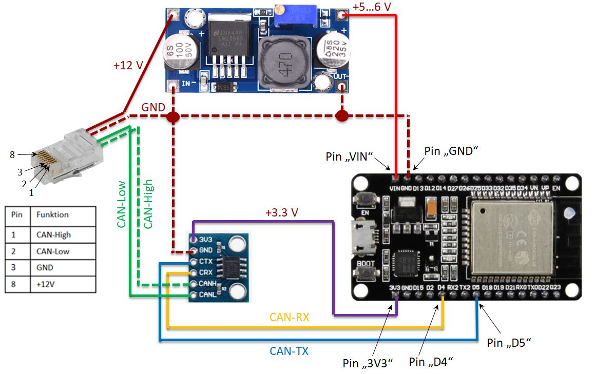
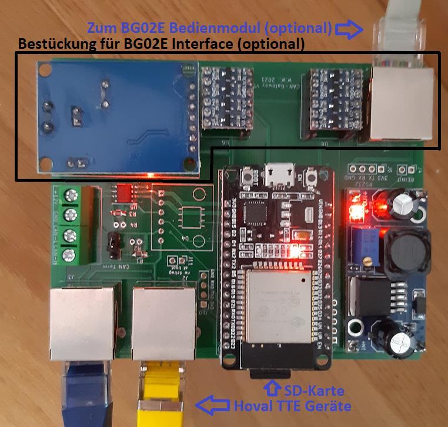

Screenshots WEB-Interface:
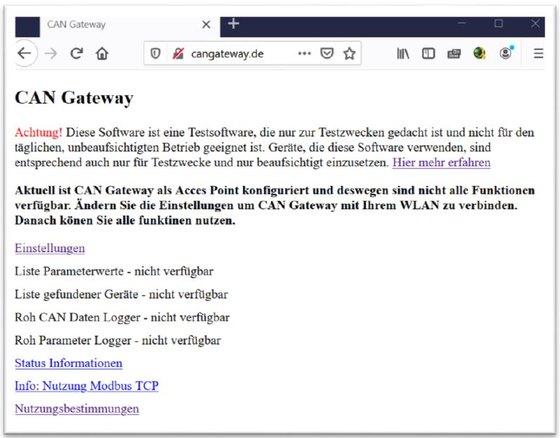
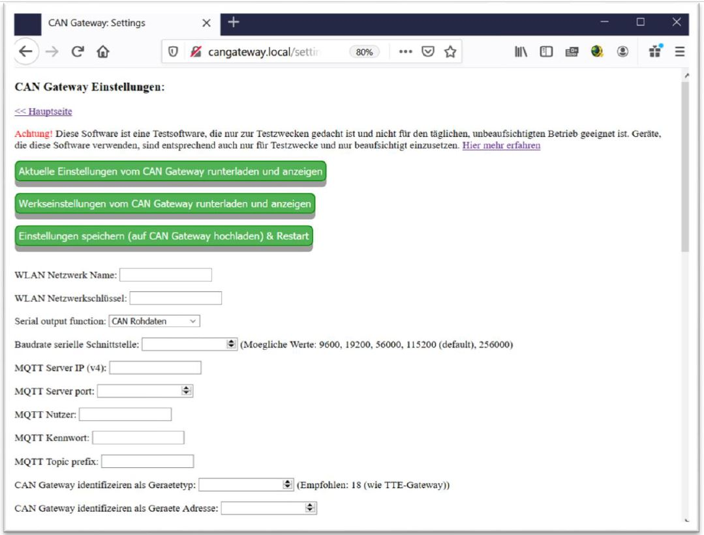
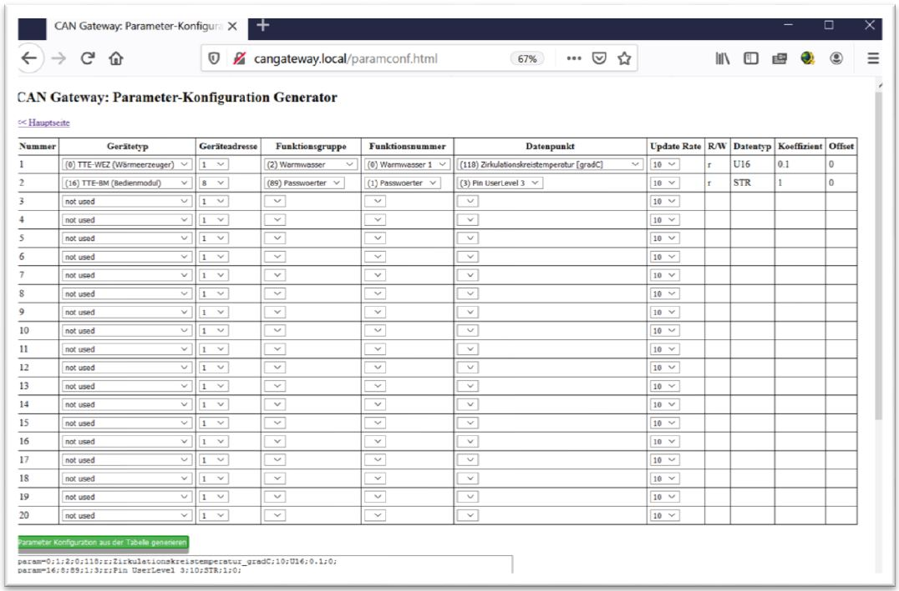
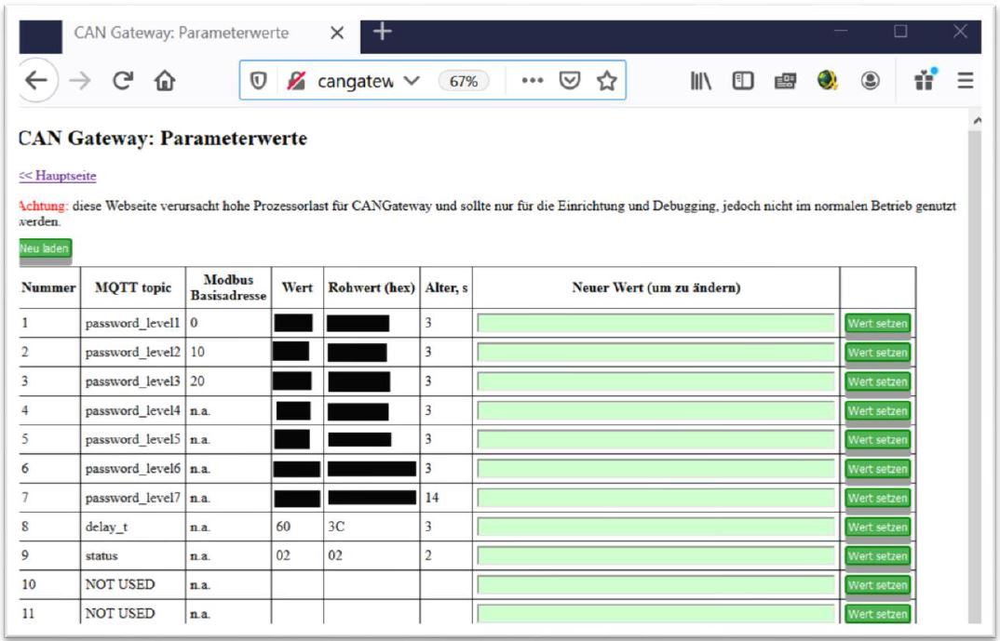
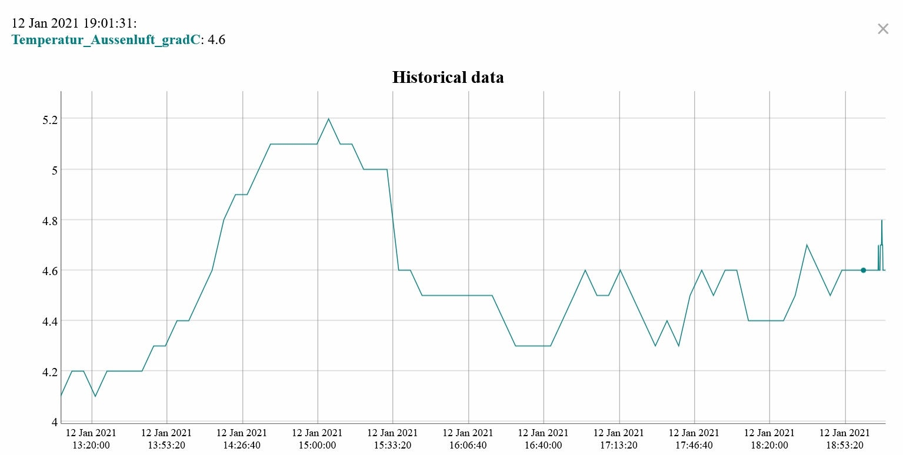
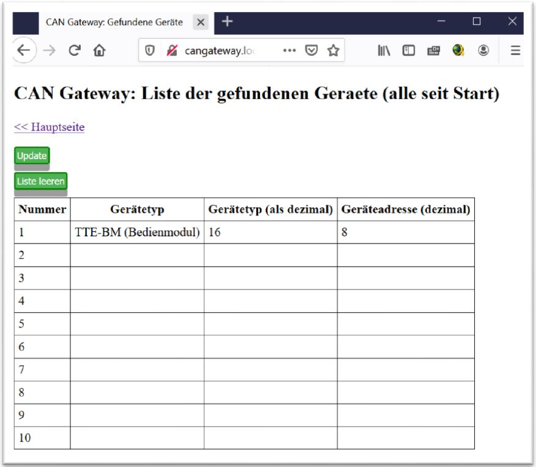
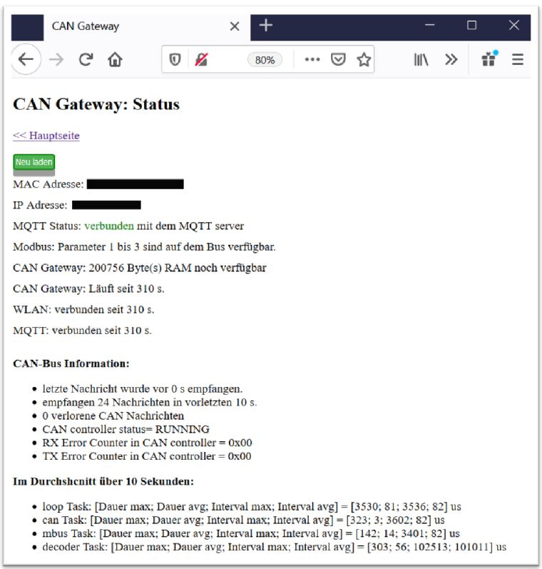
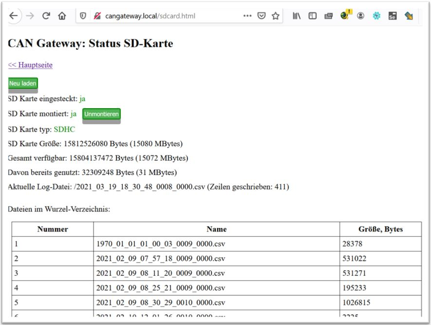
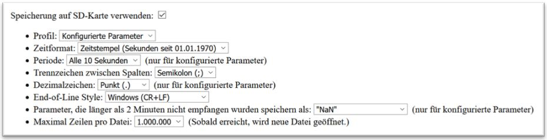
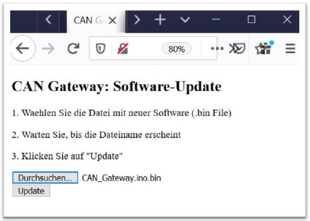
