# CAN-Gateway for Hoval devices (TopTronic&reg; E series)
DEUTSCH: [Wiki](https://github.com/wladwnt/CAN-Gateway/wiki/Deutsche-Wiki) |  [Detailierte Bedienungsanleitung](https://raw.githubusercontent.com/wladwnt/CAN-Gateway/master/Bedienungsanleitung.pdf) | [Zum CAN-Gateway in 7 Schritten](https://github.com/wladwnt/CAN-Gateway/wiki/Schritte-zum-CAN-Gateway) | [Video dazu](https://youtu.be/HU5wEv3FgdE)

ENGLISH: [Wiki](https://github.com/wladwnt/CAN-Gateway/wiki/English-Wiki) |  [Detailed operating manual](https://raw.githubusercontent.com/wladwnt/CAN-Gateway/master/Operating_manual.pdf) | [7 steps to CAN-Gateway](https://github.com/wladwnt/CAN-Gateway/wiki/Steps-to-CAN-Gateway) | [Intro video](https://youtu.be/7HJrZkuCv4k)

Fragen? / Questions? Please contact me via Email: info@myhome-control.de. (I usually answer within of 24 h. Please check your spam folder if you dont receive an answer)

What you need:
 - CAN - Gateway dev board from [MyHome-Control Shop](https://shop.myhome-control.de/CAN-Gateway-development-board/HW10018) (Germany) with optional [housing](https://shop.myhome-control.de/Gehaeuse-fuer-CAN-Gateway-Boards/ZB10001) or board + housing from [WLED SHOP](https://wled.shop/produkt/wladis-can-gateway/) (worldwide shipment). If you have HomeVent with analogue control module (type BG02E with two rotary encoders), please order the CAN-Gateway board version with second CAN interface to be able to use the control module in parallel with CAN-Gateway.
 - CAN - Gateway Software from [MyHome-Control Shop](https://shop.myhome-control.de/CAN-Gateway-Software/SW10000.1)

When you buy the software, you will additionally get access to the [CAN-Gateway online services](https://can-gateway.myhome-control.de/api/) where you can find for example SW updates and the extended database of available parameters.

Android app:  Also in Amazon AppStore: [Link](http://www.amazon.com/gp/mas/dl/android?asin=B099S815PD).

Windows App: [Download Installer](https://raw.githubusercontent.com/wladwnt/CAN-Gateway/master/App/WindowsApp/MyHomeAppSetup_Windows10_x64_v1.1.0.exe)

Bisher getestet mit: TTE-HV (HomeVent), TTE-WEZ (Wärmeerzeuger, wie Wärmepumpe), TTE-HKW (Heizkreis/Warmwasser), TTE-PS (Puffermodul), TTE-SOL (Solar), TTE-BM (Raumbedienmodul), TTE-GW (Gateway), TTE-FW (Fernwärme).

Hier ist die Software nur als eine sogenannte "Demo-Version" in kompilierter Form veröffentlicht. Diese hat im Vergleich zur vollen Version einige Einschränkungen (für Details siehe Bedienungsanleitung, Kapitel "Einschränkungen der Demo-Version").

## Einige Bilder/Screenshots:

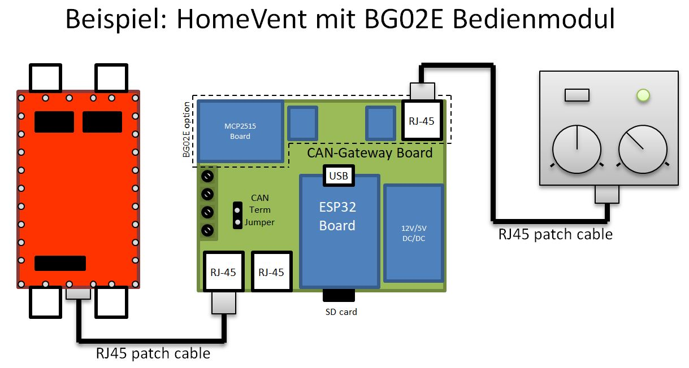

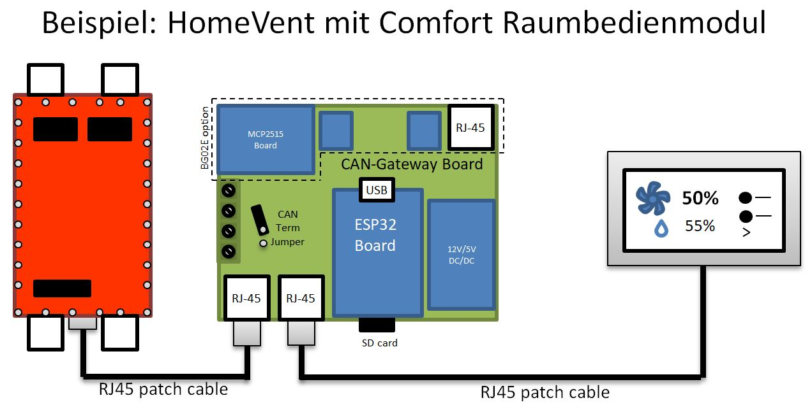

Screenshots WEB-Interface:

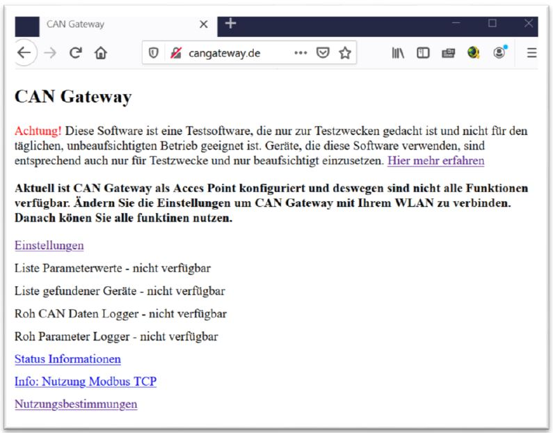

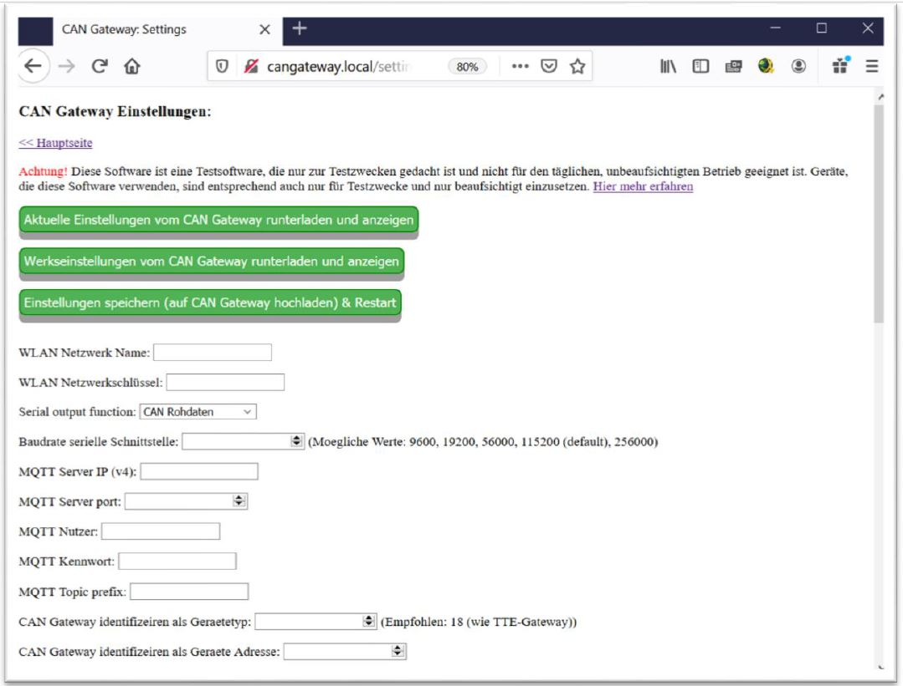

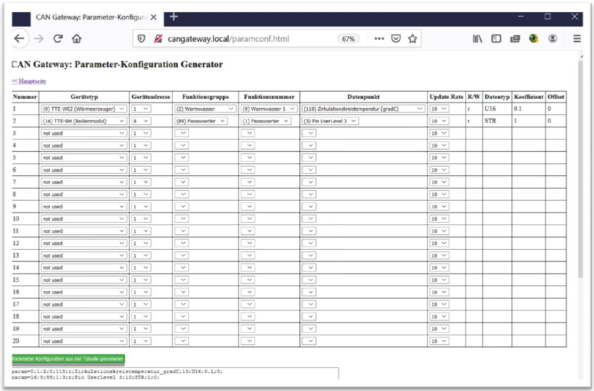

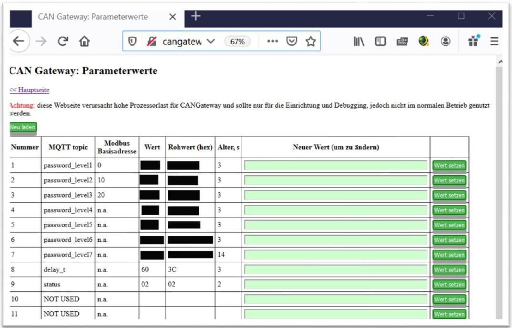

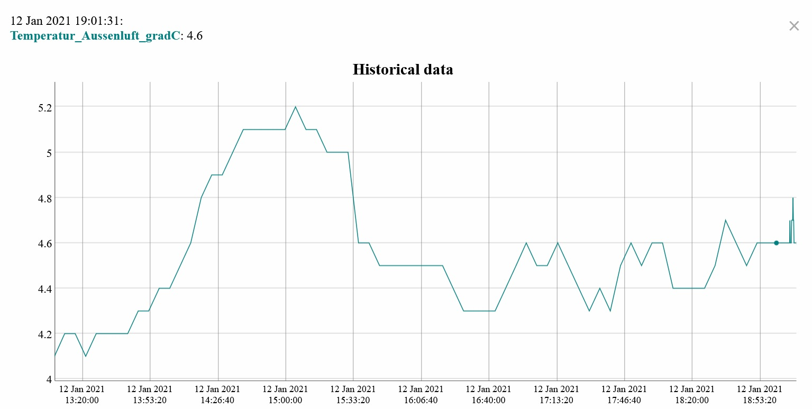

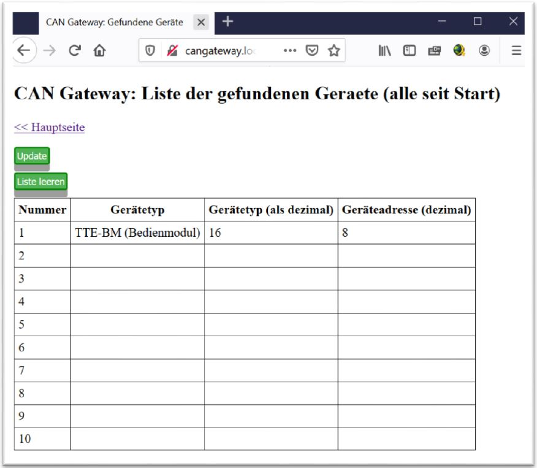

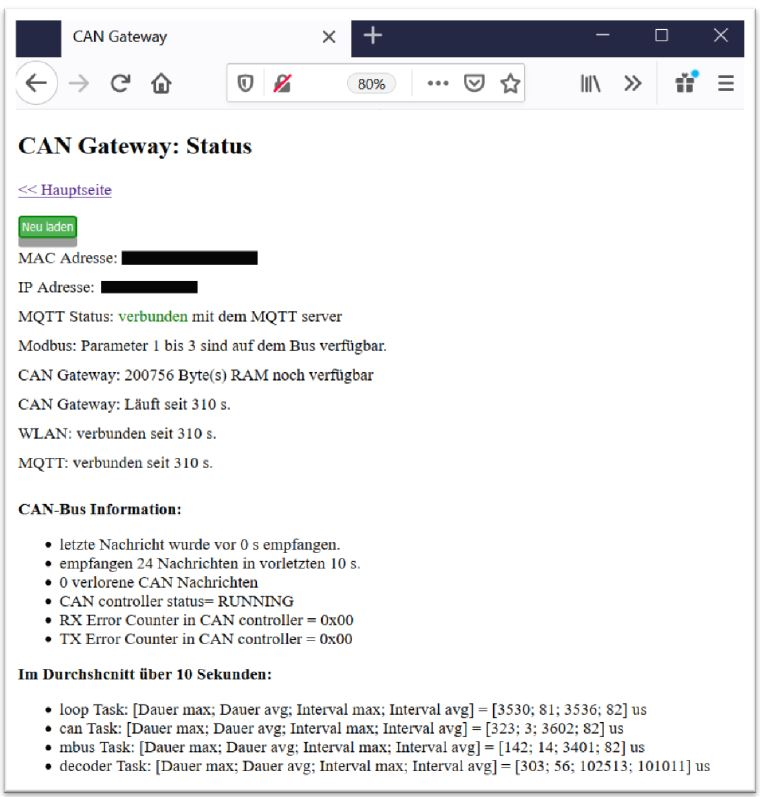

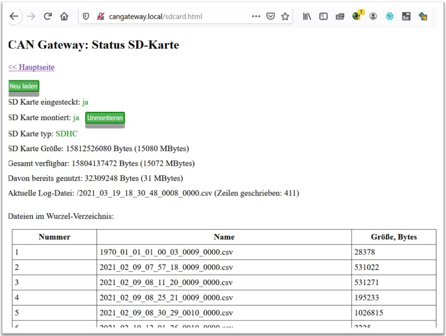

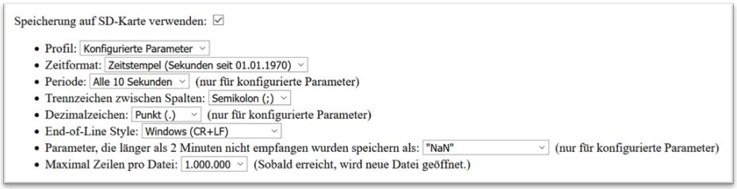

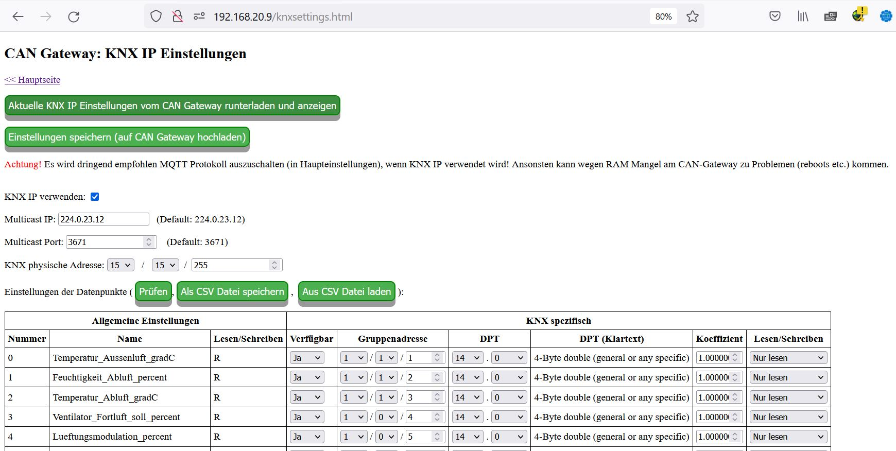

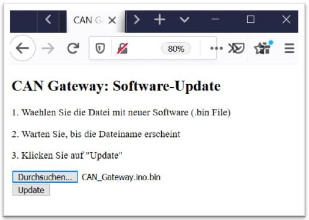

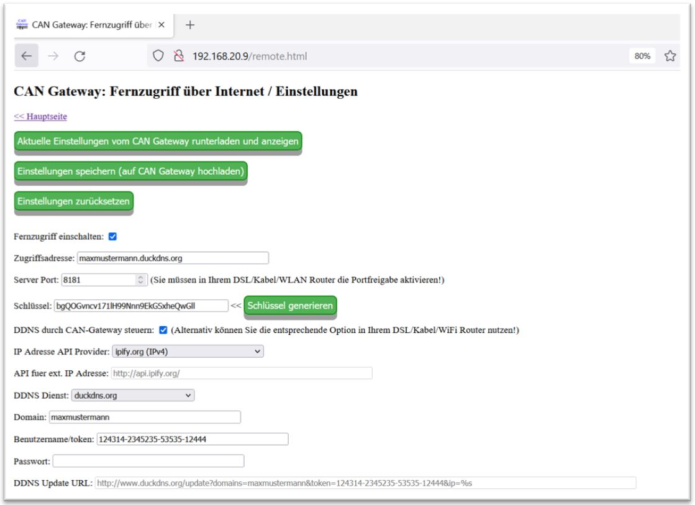

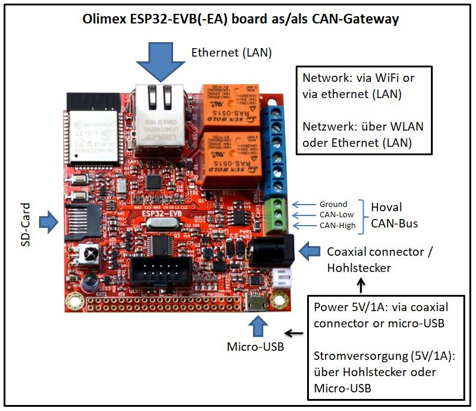

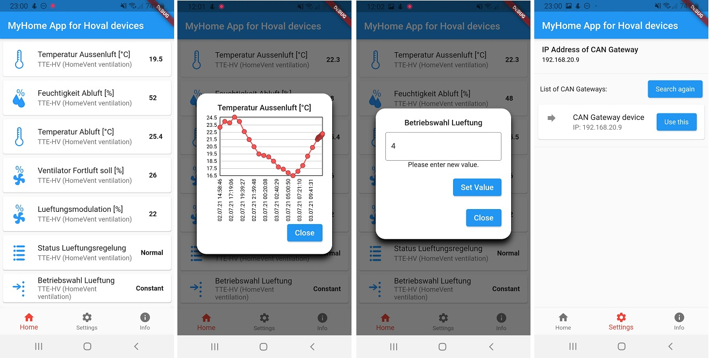

Author: Dr.-Ing. Wladislaw Waag
