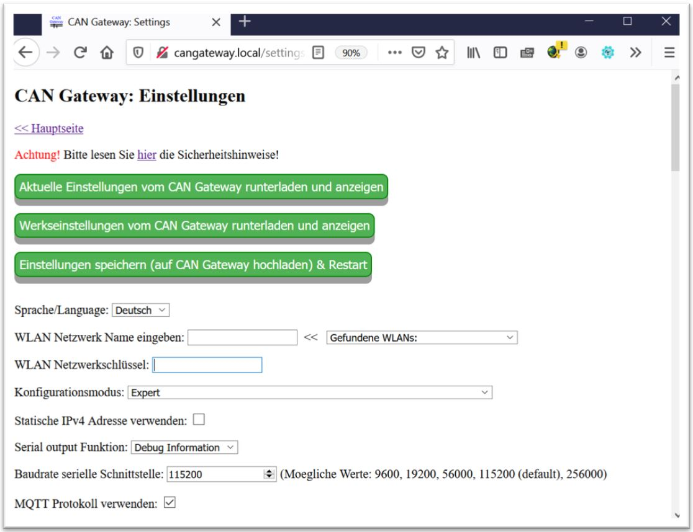

# CAN-Gateway for Hoval devices (TopTronic E&reg; series)
Detaillierte Bedienungsanleitung hier: [Bedienungsanleitung](Bedienungsanleitung.pdf)

Detailed operating manual in English: [Operating manual](Operating_manual.pdf)

Highlights und erste Schritte: [Highlights_ErsteSchritte](CANGateway_QuickStart.pdf)

NEW!!! Coming soon: Android App for CAN Gateway. [Preview](App/000.jpg)

Fragen bitte an: cangateway@gmx.de

Aktuell verkaufe ich mein zweites Board, vollständig aufgebaut und mit Vollversion der Software hier: [zu Ebay Kleinanzeigen](https://www.ebay-kleinanzeigen.de/s-anzeige/can-gateway-hoval-toptronic-r-tte-geraete-in-smarthome-connect/1799131510-168-16390)

Bisher getestet mit: TTE-HV (HomeVent), TTE-WEZ (Wärmeerzeuger), TTE-HKW (Heizkreis/Warmwasser), TTE-PS (Puffermodul), TTE-SOL (Solar), TTE-BM (Raumbedienmodul), TTE-GW (Gateway), TTE-FW.

Hier ist die Software nur als eine sogenannte "Demo-Version" in kompilierter Form veröffentlicht. Diese hat im Vergleich zur vollen Version einige Einschränkungen (für Details siehe Bedienungsanleitung, Kapitel "Einschränkungen der Demo-Version").

## Highlights:
- Anschluss an Hoval CAN-Bus
- Web-Interface
- Frei konfigurierbar
- Bis zu 40 Parametern gleichzeitig überwachen
- Sollwerte einstellen
- Anbindung der Geräte an Hausautomatisierung (z.B.Home Assistant, ioBroker, OpenHAB, Domoticz, Loxone etc.)
- Unterstützte Protokolle / Features:
  * MQTT Protokoll
  * REST API
  * Modbus TCP
  * Home Assistant MQTT Auto Discovery
- Datenlogging auf die SD-Karte

Supported devices (examples, the list is not complete)

  HomeVent&reg; comfort FR (201-301)
  HomeVent&reg; comfort FRT (251-451)
  All TopTronic E&reg;devices
  UltraSource&reg; B comfort C (8 - 17)
  UltraSource&reg; B compact C (8,11/200)
  UltraSource&reg; T comfort (8 - 17)
  UltraSource&reg; T compact (8,13/200)
  Belaria&reg; twin IR (20 - 30)
  Belaria&reg; twin A / AR (24,32)
  Belaria&reg; pro comfort (8 - 15)
  Belaria&reg; pro compact (8,13 /100/300)
  Belaria&reg; twin I (20 - 30)
  Belaria&reg; comfort ICM (8,13)
  Thermalia&reg; comfort (6 -17)
  Thermalia&reg; comfort H (5-10)
  Thermalia&reg; dual (55 - 140)
  Thermalia&reg; dual H (35 - 90)
  Thermalia&reg; twin (20 - 42)
  Thermalia&reg; twin H (13 - 22)
  BioLyt (13 - 43), (75 - 150)
  TopGas&reg; comfort inkl. TTE (10 - 22)
  TopGas&reg; classic inkl. TTE (12 - 30)
  UltraGas&reg; (15 - 27), (35 - 100), (125 - 500), (575 - 1550)
  MultiJet&reg; inkl./ohne Neutralisationsbox (12 - 25)
  MultiJet&reg; LSP (12 - 20)
  UltraOil&reg; (16 - 50), (65 - 80), (110-300)
  UltraOil&reg; D (320 - 600)
  Max-3 Öl-/Gasheizkessel mit Regelung TopTronic® E
  TransTherm&reg; giro (H0/N10 - H0/N80)
  TransTherm&reg; giro plus (H1/10 - H1/40), (H3/10 - H3/40), (H5/10), (H9/10 - 9/40)
  TransTherm&reg; pro S / B
  TransTherm&reg; aqua L / LS
  TransTherm&reg; aqua F

NOT supported devices (examples, the list is not complete)

  HomeVent&reg; RS250
  HomeVent&reg; comfort FR150, FR250, FR300, FR360 etc.
  All TopTronic T&reg; based devices
  All TopTronic C&reg; based devices
  TopGas comfort/combi inkl. RS-OT or classic (without TTE)
  Max-3 Öl-/Gasheizkessel mit Thermostaten (without TTE)
  PowerBloc EG/FG
  TransTherm&reg; aqua FT
  TransTherm&reg; aqua FTC

## Kurze Beschreibung:

- Diese Software erlaubt es testweise die Geräte der Serie „TopTronic® E“ (TopTronic® E ist die geschützte und eingetragene Marke der Firma Hoval AG) der Firma Hoval Aktiengesellschaft an das Hausautomatisierungssystem anzubinden. Diese Geräte werden im Folgenden einfach „Geräte“ genannt. 
- Die Geräte der Serie „TopTronic® E“ der Firma Hoval Aktiengesellschaft besitzen einen CAN-Bus Anschluss. Dieser wird für die Verbindung der Geräte untereinander verwendet. CAN-Gateway kann an dieses CAN-Bus angeschlossen werden und kann die auf dem Bus übertragenen Daten entschlüsseln und selbst die Daten auf dem Bus generieren, so dass damit Auslesen der Informationen aus den Geräten sowie die Steuerung der Geräte für Testzwecke möglich ist.
- Diese Software selber muss dafür auf einem ESP32 DevKit Board installiert werden. Die genaue Beschreibung der benötigten Hardwarekomponenten und der Aufbau ist in der Bedienungsanleitung zu finden. Der so aufgebaute ESP32 DevKit Board mit installierter Software wird im Folgenden als „CAN-Gateway“ bezeichnet.
- ESP32 DevKit Board besitzt einen WLAN Interface, so dass das Hausautomatisierungssystem kann über WLAN mit dem CAN-Gateway verbunden werden. Als Datenübertragungsprotokolle zwischen CAN-Gateway und dem Hausautomatisierungssystem können wahlweise MQTT Protokoll, Modbus TCP Protokoll oder REST-API verwendet werden, wobei MQTT Protokoll empfohlen wird und Modbus TCP Protokoll nur mit einigen Einschränkungen funktioniert.
- Über WLAN Interface kann CAN-Gateway mithilfe eines Internet Browsers konfiguriert werden.
- NEU: Als Datenlogger mit Speicherung der Daten auf einer SD-Karte einsetzbar (In Verbund mit CAN-Gateway Hardware V5 und höher)

(*) TopTronic E, Ultrasource, Belaria, Thermalia, TransTherm, TopGas, UltraGas, MultiJet, UltraOil, HomeVent  are registered trademarks of Hoval AG

## Einige Bilder/Screenshots:
Aufbau der Hardware:

Screenshots WEB-Interface:

