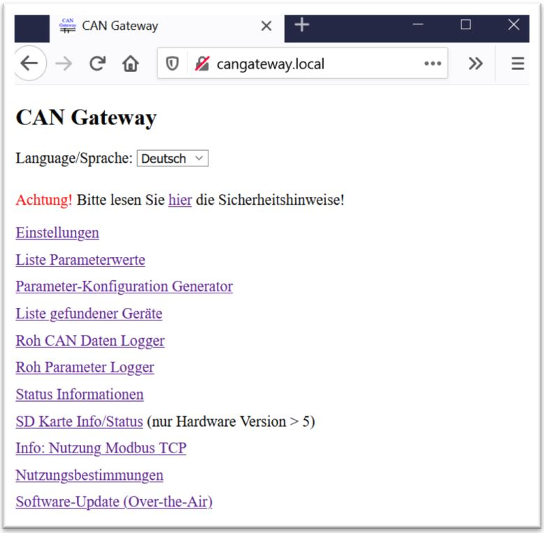
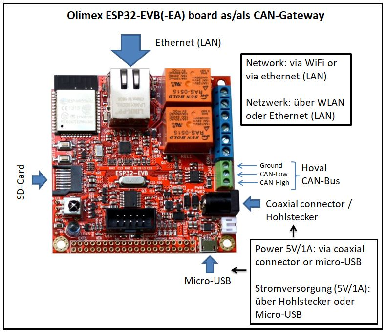

# CAN-Gateway for Hoval devices (TopTronic&reg; E series)
DEUTSCH: [Wiki](https://github.com/wladwnt/CAN-Gateway/wiki/Deutsche-Wiki) |  [Detailierte Bedienungsanleitung](https://raw.githubusercontent.com/wladwnt/CAN-Gateway/master/Bedienungsanleitung.pdf) | [Zum CAN-Gateway in 7 Schritten](https://github.com/wladwnt/CAN-Gateway/wiki/Schritte-zum-CAN-Gateway) | [Video dazu](https://youtu.be/HU5wEv3FgdE)

ENGLISH: [Wiki](https://github.com/wladwnt/CAN-Gateway/wiki/English-Wiki) |  [Detailed operating manual](https://raw.githubusercontent.com/wladwnt/CAN-Gateway/master/Operating_manual.pdf) | [7 steps to CAN-Gateway](https://github.com/wladwnt/CAN-Gateway/wiki/Steps-to-CAN-Gateway) | [Intro video](https://youtu.be/7HJrZkuCv4k)

Fragen? / Questions? Please contact me via Email: cangateway@gmx.de. (I usually answer within of 48 h. Please check your spam folder if you dont receive an answer)

Die beste Hardware für CAN-Gateway Software ist [CAN-Gateway development board](http://wled.shop/wp-content/uploads/2021/11/CAN_Gateway_Nutzungsinformationen.pdf), zu kaufen für 45,90 € bei [WLED SHOP](https://wled.shop/produkt/wladis-can-gateway/)

The best hardware platform for CAN-Gateway Software is [CAN-Gateway development board](http://wled.shop/wp-content/uploads/2021/11/CAN_Gateway_Nutzungsinformationen.pdf) sold at [WLED SHOP](https://wled.shop/produkt/wladis-can-gateway/) for 45,90 € (incl. housing) or at [MyHom-Control Shop](https://shop.myhome-control.de/CAN-Gateway-development-board/HW10018).

**NEW !!!** Version 30.011: Online-Services introduced including advanced parameter database and error decoder. Demo: [https://can-gateway.myhome-control.de/api/](https://can-gateway.myhome-control.de/api/)

**NEW !!!** version 30.020: Alle Parameter/Datenpunkte eines Geräts auslesen und als eine CSV Datei abspeichern (z.B. als Backup, oder um die Einstellungen zwei Geräte zu vergleichen)

Die Vollversion der Software ist in meinem Webshop verfügbar: [shop.myhome-control.de](https://shop.myhome-control.de)

The full software version is available in my web shop: [shop.myhome-control.de](https://shop.myhome-control.de/en/)

**Bekannte Probleme: Es gibt einige Hinweise darauf, dass die WLAN Verbindung mit einigen WLAN Routern sehr schlecht funktioniert (WEB-Interafce vom CAN-Gateway sehr langsam), wenn der WLAN Router Funkkanal 6 oder Funkkanal 7 verwendet. Lösung: stellen Sie in Ihrem WLAN Router ein, dass Funkkanal 1  (2,4 GHz Band) verwendet werden soll.**

**Known Issues: There is some indications that the WiFi connection with some WiFi routers works very poorly (WEB interface from CAN-Gateway very slow) when the WiFi router uses radio channel 6 or 7. Solution: set your WiFi router to use radio channel 1 (2.4 GHz band).** 

Android app:  Also in Amazon AppStore: [Link](http://www.amazon.com/gp/mas/dl/android?asin=B099S815PD).

Windows App: [Download Installer](https://raw.githubusercontent.com/wladwnt/CAN-Gateway/master/App/WindowsApp/MyHomeAppSetup_Windows10_x64_v1.1.0.exe)

Bisher getestet mit: TTE-HV (HomeVent), TTE-WEZ (Wärmeerzeuger), TTE-HKW (Heizkreis/Warmwasser), TTE-PS (Puffermodul), TTE-SOL (Solar), TTE-BM (Raumbedienmodul), TTE-GW (Gateway), TTE-FW (Fernwärme).

Hier ist die Software nur als eine sogenannte "Demo-Version" in kompilierter Form veröffentlicht. Diese hat im Vergleich zur vollen Version einige Einschränkungen (für Details siehe Bedienungsanleitung, Kapitel "Einschränkungen der Demo-Version").

## Einige Bilder/Screenshots:

Screenshots WEB-Interface:

Author: Dr.-Ing. Wladislaw Waag
