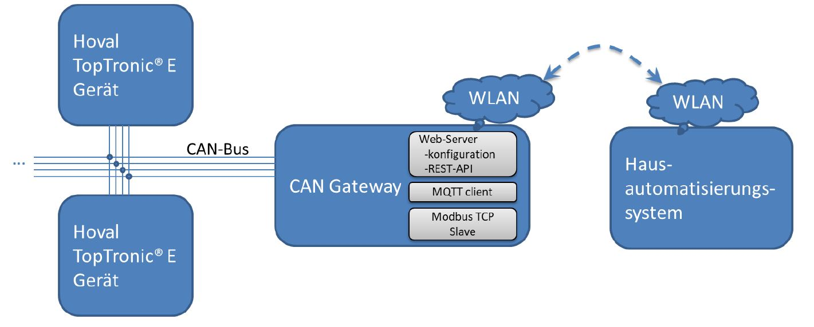
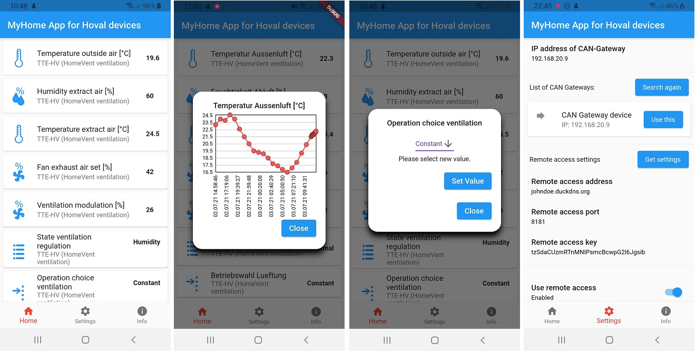

# CAN-Gateway for Hoval devices (TopTronic E&reg; series)
DEUTSCH: [Wiki](https://github.com/wladwnt/CAN-Gateway/wiki/Deutsche-Wiki) |  [Detailierte Bedienungsanleitung](https://raw.githubusercontent.com/wladwnt/CAN-Gateway/master/Bedienungsanleitung.pdf)

ENGLISH: [Wiki](https://github.com/wladwnt/CAN-Gateway/wiki/English-Wiki) |  [Detailed operating manual](https://raw.githubusercontent.com/wladwnt/CAN-Gateway/master/Operating_manual.pdf)

Aktuell verkaufe ich  für **129 €** mein zweites CAN-Gateway, vollständig aufgebaut und mit Vollversion der Software hier / currently I sell my second CAN-Gateway board including full SW version for **129 €**: [zu Ebay Kleinanzeigen](https://www.ebay-kleinanzeigen.de/s-anzeige/can-gateway-hoval-toptronic-r-tte-geraete-in-smarthome-connect/1799131510-168-16390) or just contact me cangateway@gmx.de

Möchten Sie erst ausprobieren? Das Board mit **Demo-Version für nur 29€**  zzgl. Versand, später Update auf Vollversion (+100€) möglich.

**NEW!!!** Android app:  Also in Amazon AppStore: [Link](http://www.amazon.com/gp/mas/dl/android?asin=B099S815PD).

**NEW!!!** Windows App: [Download Installer](https://raw.githubusercontent.com/wladwnt/CAN-Gateway/master/App/WindowsApp/MyHomeAppSetup_Windows10_x64_v1.1.0.exe)

**COMING SOON!** KNX IP Interface! Integrate CAN-Gateway in your KNX based home system!

Fragen bitte an / questions please via: cangateway@gmx.de

Bisher getestet mit: TTE-HV (HomeVent), TTE-WEZ (Wärmeerzeuger), TTE-HKW (Heizkreis/Warmwasser), TTE-PS (Puffermodul), TTE-SOL (Solar), TTE-BM (Raumbedienmodul), TTE-GW (Gateway), TTE-FW.

Hier ist die Software nur als eine sogenannte "Demo-Version" in kompilierter Form veröffentlicht. Diese hat im Vergleich zur vollen Version einige Einschränkungen (für Details siehe Bedienungsanleitung, Kapitel "Einschränkungen der Demo-Version").

## Einige Bilder/Screenshots:
Aufbau der Hardware:

Screenshots WEB-Interface:

